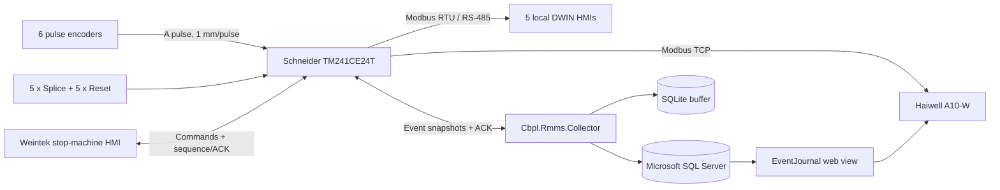

# CBPL-RMMS

**Corrugated Board Production Line — Raw Material Metering System**

Industrial automation system for raw-material metering, finished-board output,
roll-event journaling and operator diagnostics on a corrugated-board production
line.

The project combines a Schneider Electric Modicon M241 PLC, six hardware pulse
counters, five local DWIN panels, a central Haiwell HMI, an existing Weintek
operator panel, a fault-tolerant .NET collector, SQLite and Microsoft SQL Server.

This is the public engineering version of the project. Operational addresses,
credentials and live production data are replaced with local demonstration
values. Vendor project archives will be added only after they are converted
into a reviewable form and checked for embedded connection settings.

## What the system does

- meters five independent raw-material unwinds;
- meters finished board and calculates line speed;
- keeps current and previous roll lengths;
- distinguishes automatic `Splice` from manual `Reset`;
- restores retained state after a power interruption;
- queues immutable events inside the PLC;
- transfers events over Modbus TCP with CRC and explicit acknowledgement;
- buffers them transactionally in SQLite;
- synchronizes operational data and journals with SQL Server;
- supplies local, central and legacy-HMI visualization;
- prevents duplicate stop-journal records through an idempotent SQL receipt.

## Architecture

The PLC remains the owner of machine state and event queues. The server only
acknowledges an event after durable storage succeeds.

## Reliability features

- `PERSISTENT RETAIN` FIFO queues in the PLC;
- monotonic event identifiers;
- CRC16 test vectors shared by PLC and server;
- double-read consistency checks for Modbus snapshots;
- transaction-before-ACK ordering;
- unique SQLite event identifiers;
- SQL duplicate-protection receipts;
- safe read-only commissioning mode;
- heartbeat and protocol-version diagnostics;
- recovery after PLC, network, SQL or collector restart.

## Repository layout

| Path | Contents |
|---|---|
| `plc/` | IEC 61131-3 Structured Text sources and protocol vectors |
| `server/` | .NET collector, EventJournal web service, SQL and automated tests |
| `hmi/haiwell/` | Screen specification, tag map and SQL history design |
| `hmi/weintek/` | Sanitized macros adapted to the new PLC interface |
| `hardware/` | Electrical interface diagrams |
| `docs/` | Architecture, commissioning notes and implementation status |

## PLC design

- controller: Schneider Electric Modicon `TM241CE24T`;
- task: 20 ms cyclic MAST;
- six `HSC Simple` channels on fast inputs `I0...I5`;
- encoder scale: 250 pulses/revolution and 250 mm wheel circumference;
- resulting scale: **1 pulse = 1 mm**;
- five independent roll counters plus one finished-board line meter;
- separate inputs for `Splice` and `Reset` through `TM3DI16`;
- dedicated Modbus maps for event transfer, Haiwell and Weintek.

The principal function blocks are `FB_HscTracker`, `FB_RollCounter`,
`FB_LineMeter`, `FB_ShiftManager`, `FB_RollEventQueue`, `FB_StopMachine` and
`FB_StopJournalQueue`.

## Server design

`Cbpl.Rmms.Collector` is a C#/.NET process containing a minimal Modbus TCP
client, protocol decoders, transactional SQLite storage, SQL Server sinks and
retry logic. `Cbpl.Rmms.EventJournal` provides read-only event-history pages for
the central HMI.

Configuration shipped here is safe by default:

- PLC writes disabled;
- SQL synchronization disabled;
- loopback addresses only;
- no credentials or production addresses.

## Current implementation status

| Area | Status |
|---|---|
| PLC program | Imported, built without errors/warnings and loaded to a running TM241 |
| Roll and stop-journal queues | Implemented with persistent storage and explicit ACK |
| .NET collector | Built, tested and deployed in the production environment |
| SQL duplicate protection | Created and successfully checked |
| DWIN communication | PLC register map prepared; a reviewable panel export and commissioning record are pending |
| Haiwell screens and event history | Designed and implemented in stages; final project archive is pending |
| Weintek macro migration | Prepared; complete production scenario regression remains pending |
| Automatic web-break splice | Engineering prototype stage |

See [implementation status](docs/implementation-status.md) and
[commissioning checklist](docs/commissioning.md) for the exact boundary between
verified work and planned work.

## Safety

CBPL-RMMS is a production-accounting and supervisory-control system. It is **not
a functional-safety system** and must not replace machine emergency-stop,
guarding or certified safety circuits.

